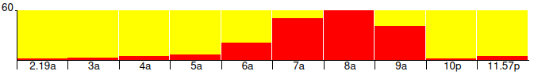

# Happy Day Histogram

## What

Happy Day Histogram (HDH) is a simple JavaScript library for generating a
client side histogram showing activity events per hour for 
a day:



See a [live example](https://mrjones-plip.github.io/Happy-Day-Histogram/example/)!

This JavaScript
library uses no 3rd party libraries (eg D3 or jQuery). 
The DOM elements used are only
HTML (floating DIVs) and not any fancy Canvas or SVG. The final histogram is very 
fast to render and is 100% responsive, looking good on both mobile
and desktop browsers.  It was created to visualize minutes a devices is online in awesome 
[Legba the Net-Tracker](https://github.com/mrjones-plip/legba).

This is a fork of the original [Happy Histogram](https://github.com/Packet-Clearing-House/Happy-Histogram/)
which is a more full-featured histogram library for visualizing a year.

## How

1. Download [the latest HDH](https://github.com/mrjones-plip/Happy-Day-Histogram) and
 grab the minified CSS and JS from the `dist` directory.
2. Include HDH's JavaScript and CSS: 
   ```
   <script src="HappyDayHistogram.min.js" ></script>
   <link rel="stylesheet" href="HappyDayHistogram.min.css" />
   ```
3. Define the HTML where you want to render your histogram (must be an ID): ``<div id="histogram"></div>``
4. Declare your data set as an array, one amount for each hour. Hours with a value of 0 will be skipped in the histogram: 

   ```javascript
    let hours = [
        0,
        0,
        1,
        2,
        4,
        5,
        20,
        50,
        60,
        40,
        40,

        0,
        0,
        0,
        0,
        0,
        0,
        0,
        0,
        0,
        0,

        0,
        0,
        1,
        4
    ];
   ```
   
   Careful!  Garbage in, garbage out - HDH will do it's best to validate values (no more than 24 total, 
   no more than 60/hr), but may fail.
5. Call HDH specifying target, data and CSS color: ``HappyDayHistogram('histogram', hours);`` . Your target must be an ID, not a class. 

### Extras

**Bar Color** - Pass in the CSS value when you
call HDH: ``HappyDayHistogram('histogram', hours, 'red');`` or ``HappyDayHistogram('histogram', hours, '#ddd');``. Default color is ``#043864``

**Custom Lables** - Pass in an array of `labels`. This will allow you, for example to denote minute of the first
event like this:

```javascript
let labels = [];
labels[2] = '2.19a'
labels[23] = '11.57p'

new HappyDayHistogram('histogram', hours, 'aqua', labels);
```

**Histogram Height** -  _After_ you have included HDH's CSS, declare an update CSS entry for the height ``.dayHistogram .hour .chart { height: 25px; }``

**Background Color** - _After_ you have included HDH's CSS, declare an update CSS entry
for the background ``.dayHistogram .emptyTop { background-color: yellow; }``

**Hover color for just data bar** - Again, _after_ you have included HDH's CSS, declare
 a ``hover`` psuedo class for just the bottom part.  Note that you'll need include
 the ID of the  DOM element for you histogram: ``#histogram .dayHistogram .filledBottom:hover {background-color: #ddd;}``

**Hover color entire bar, all the way to the top** - Again, _after_ you have included HDH's CSS, declare
 a ``hover`` psuedo class for just the entire.  Note that you'll need include
 the ID of the  DOM element for you histogram: ``#histogram .dayHistogram .bar:hover {background-color: #ddd;}``


